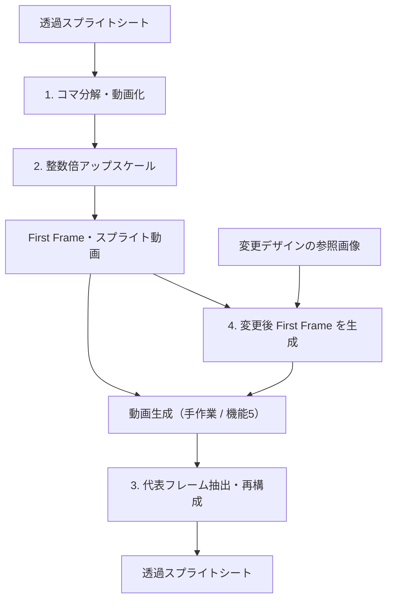

[README.md](https://github.com/user-attachments/files/31991023/README.md)
# Sprite Edit

透過スプライトシートを動画へ変換し、生成AIで衣装・デザインを変更したあと、元の配置を保ったスプライトシートへ再構成するローカルツールです。Gradioの画面から操作できます。

## 処理フロー



通常は「かんたん」画面を使用します。動画生成のみ外部ツールで行い、完成した動画を本ツールへ戻します。機能5による動画生成は「詳細」画面から試せます。

入力には透過スプライトシートを推奨します。格子の自動検出が合わない場合は、画面で列数・行数を指定してください。

## 主な機能

| 機能 | 内容 |
| --- | --- |
| 1 | シートの格子を検出し、各コマとパラパラ動画を作成 |
| 2 | CPUで最近傍・整数倍アップスケールし、First Frameと動画を出力 |
| 3 | 編集後の動画から各ポーズを抽出し、元の配置・透過情報でシートを再構成 |
| 4 | esora APIでデザイン変更後のFirst Frameを生成 |
| 5 | esora APIで参考動画と画像から動画を生成（詳細画面のみ） |

## 動作環境

- Python 3.10+
- Windows / macOS / Linux
- esora API CLI（機能4・5を使う場合のみ。Python 3.12+の別環境を推奨）

`ffmpeg`がPATHにない場合は、`imageio-ffmpeg`に含まれる実行ファイルを使用します。

## セットアップ

```bash
git clone https://github.com/ryoheimongami8/sprite-edit.git
cd sprite-edit/app
python -m venv .venv
```

仮想環境を有効化して依存関係をインストールします。

```powershell
# Windows
.venv\Scripts\Activate.ps1
```

```bash
# macOS / Linux
source .venv/bin/activate
```

```bash
pip install -r requirements.txt
python app.py --open
```

ブラウザが自動で開かない場合は、[http://127.0.0.1:7860](http://127.0.0.1:7860)へアクセスしてください。

機能4・5を使用する場合は、事前にesora API CLIでログインします。CLIがPATHにない場合は、環境変数`ESORA_CLI_PATH`へ実行ファイルのフルパスを設定してください。

```bash
esora-api auth login
```

## 出力

処理結果は`app/work/<日時>_<ファイル名>/`へセッション単位で保存されます。主な最終出力は次の2種類です。

- `10_rebuilt_sheets/sprite_original_alpha.png`
- `10_rebuilt_sheets/sprite_chromakey.png`

元画像のアルファを適用した版と、背景色をクロマキー処理した版を比較して選択できます。

詳しい処理仕様、出力構成、各機能の使い方は[app/README.md](app/README.md)を参照してください。
