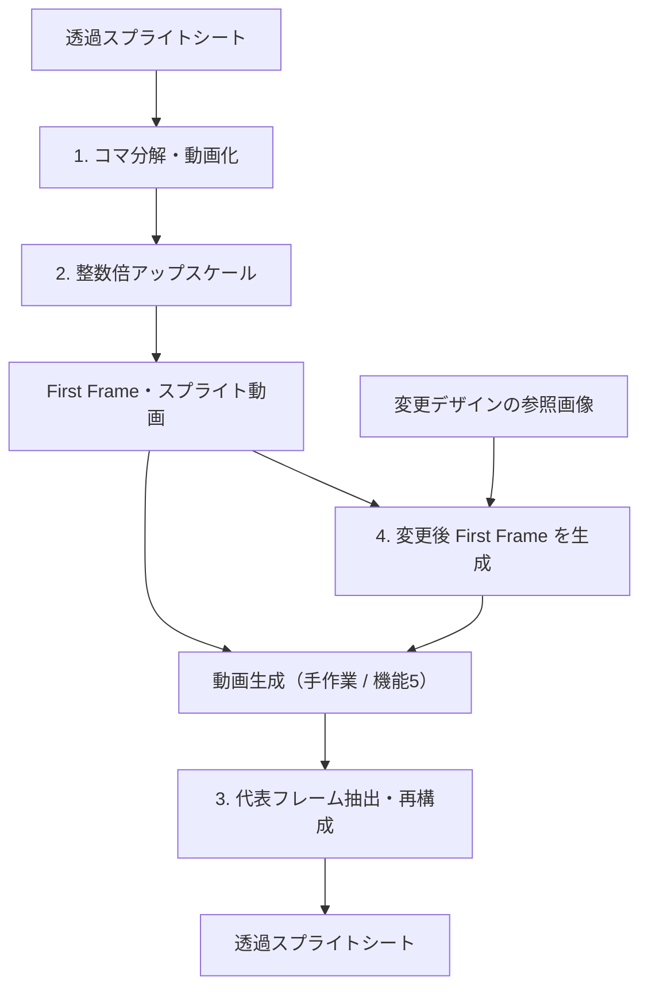

[README.md](https://github.com/user-attachments/files/31991023/README.md)
# Sprite Edit

透過スプライトシートを動画へ変換し、生成AIで衣装・デザインを変更したあと、元の配置を保ったスプライトシートへ再構成するローカルツールです。Gradioの画面から操作できます。


透過スプライトシートと、変更デザイン参照画像を準備して画像のようにアップロードしてステップ1を実行
これで1枚の画像変更を行います。（これが動画生成の最初のフレーム）


## 処理フロー



通常は「かんたん」画面を使用します。動画生成のみ外部ツールで行い、完成した動画を本ツールへ戻します。機能5による動画生成は「詳細」画面から試せます。

入力には透過スプライトシートを推奨します。格子の自動検出が合わない場合は、画面で列数・行数を指定してください。

## 主な機能

| 機能 | 内容 |
| --- | --- |
| 1 | シートの格子を検出し、各コマとパラパラ動画を作成 |
| 2 | CPUで最近傍・整数倍アップスケールし、First Frameと動画を出力 |
| 3 | 編集後の動画から各ポーズを抽出し、元の配置・透過情報でシートを再構成 |
| 4 | esora APIでデザイン変更後のFirst Frameを生成 |
| 5 | esora APIで参考動画と画像から動画を生成（詳細画面のみ） |

## 動作環境

- Python 3.10+
- Windows / macOS / Linux
- esora API CLI（機能4・5を使う場合のみ。Python 3.12+の別環境を推奨）

`ffmpeg`がPATHにない場合は、`imageio-ffmpeg`に含まれる実行ファイルを使用します。

## セットアップ

```bash
git clone https://github.com/ryoheimongami8/sprite-edit.git
cd sprite-edit/app
python -m venv .venv
```

仮想環境を有効化して依存関係をインストールします。

```powershell
# Windows
.venv\Scripts\Activate
```

```bash
# macOS / Linux
source .venv/bin/activate
```

```bash
pip install -r requirements.txt
python app.py --open
```

ブラウザが自動で開かない場合は、[http://127.0.0.1:7860](http://127.0.0.1:7860)へアクセスしてください。

機能4・5を使用する場合は、事前にesora API CLIでログインします。CLIがPATHにない場合は、環境変数`ESORA_CLI_PATH`へ実行ファイルのフルパスを設定してください。

```bash
esora-api auth login
```

## プロンプト

画像生成
```bash
@img:1 ▾ をベース画像として直接編集し、騎乗している人物の衣装・防具・兜のみを @img:2 ▾ のデザインに変更してください。
画像1は、構図・位置・ポーズ・シルエット・描画スタイルの基準です。画像2は、衣装の配色と装備デザインのみの参照です。画像2の立ち姿、体格、顔、頭身、画風は適用しないでください。
【最優先で維持するもの】
画像1と重ね合わせたときに、馬の輪郭、騎手の頭、肩、肘、両手、膝、足先、剣先、剣を握る位置が一致するようにしてください。人物の向き、頭の傾き、胴体の傾き、腕の曲がり方、騎乗姿勢を維持してください。
剣の長さ・幅・角度・位置は変更しないでください。
顔と手・腕・剣の前後関係、および顔が隠れている範囲をそのまま維持してください。顔を見せるために頭や腕を移動したり、見えていない顔の部分を描き足したりしないでください。
【変更するもの】
画像2の青い板状の鎧、肩当て、白い袖、濃紺の腰布、青い腕と脚の防具、兜の意匠を、画像1の人物の各部位に合わせて反映してください。
衣装は画像1の既存のポーズと外形に収まるように簡略化してください。肩当てや兜の飾りを再現するために、人物の輪郭や身体の位置を広げたり動かしたりしないでください。細かい模様の再現よりも、元の外形とポーズの一致を優先してください。
【描画スタイル】
画像1の大きなピクセルブロック、輪郭の段差、陰影の粗さ、情報量を維持してください。新しい衣装も同じ描画密度で表現してください。細密化、輪郭のシャープ化、滑らかな線への描き直しは行わないでください。
【そのまま残すもの】
馬の全身、馬具、手綱、剣、背景のマゼンタ色、地面の影は、画像1の見た目をそのまま残してください。毛並み、筋肉、線、陰影を追加しないでください。
キャンバスの縦横比、被写体の大きさ、配置、余白を維持し、拡大縮小・中央寄せ・トリミングは行わないでください。
完成画像を1枚だけ出力してください。
```

動画生成
```bash
参考動画の動作とタイミングを維持し、騎手の衣装を参考画像のデザインに統一した、5秒間のゲーム用スプライト動画を作成してください。
【参照素材の役割】
参考動画：全編のポーズ、向き、各部位の位置、動作順序、ポーズの保持時間、切り替えタイミングの基準。
参考画像：開始時の外観、および全編を通じた衣装・防具・兜・配色・描画スタイルの基準。
参考動画の旧衣装を混ぜず、最初から最後まで参考画像の同じ衣装を維持してください。
【動きの再現】
参考動画と同じ、静止画像を順番に切り替えるパラパラアニメーションにしてください。
参照動画で同じポーズが表示されている間は、出力もそのポーズで完全に静止してください。次のポーズに変わる時刻に、出力も瞬時に切り替えてください。
各ポーズの順序、表示時間、繰り返し回数を参照動画と一致させてください。途中のポーズを追加・省略したり、動作の速度を変更したりしないでください。
ポーズ間の補間、滑らかな移行、モーフィング、クロスフェード、モーションブラーは使用しないでください。
【位置と構図の維持】
各時刻で、馬の頭・胴体・脚・蹄・尾、騎手の頭・胴体・肘・両手・膝・足先、剣先と剣を握る位置を、参考動画の対応する位置に合わせてください。
剣の長さ、角度、向き、および顔と手・腕・剣の重なり方を維持してください。顔が隠れるポーズでは、その隠れ方を維持してください。
参照動画にある上下動や位置の変化だけを再現し、被写体の中央寄せや位置の自動補正はしないでください。
【外観の一貫性】
騎手の衣装・防具・兜は、すべてのポーズで参考画像と同じ部品構成、配色、模様を維持してください。ポーズに応じた見え方の変化だけを表現してください。
ピクセルの粗さ、輪郭の表現、陰影の段階、描き込み量を参考画像に揃え、途中で細密化や画風の変更をしないでください。
参照動画にない呼吸、瞬き、髪や布の揺れ、馬の耳や尾の動きを追加しないでください。
【背景と出力】
カメラを固定し、画角、被写体の大きさ、余白を維持してください。ズーム、パン、カメラの回転、場面転換は不要です。
背景色は参照素材の単色を全編で均一に維持してください。影は参考動画にあるものだけを再現してください。
開始前の静止時間、終了後の余韻、フェードイン・フェードアウトを追加せず、参考動画と同じ開始タイミングと終了タイミングで、5秒間を出力してください。

```


## 出力

処理結果は`app/work/<日時>_<ファイル名>/`へセッション単位で保存されます。主な最終出力は次の2種類です。

- `10_rebuilt_sheets/sprite_original_alpha.png`
- `10_rebuilt_sheets/sprite_chromakey.png`

元画像のアルファを適用した版と、背景色をクロマキー処理した版を比較して選択できます。

詳しい処理仕様、出力構成、各機能の使い方は[app/README.md](app/README.md)を参照してください。
